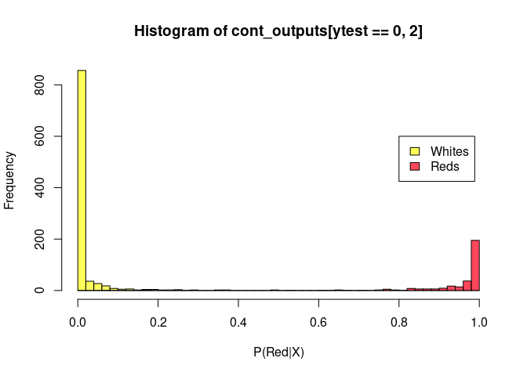
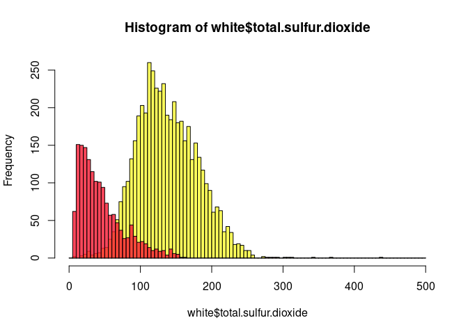
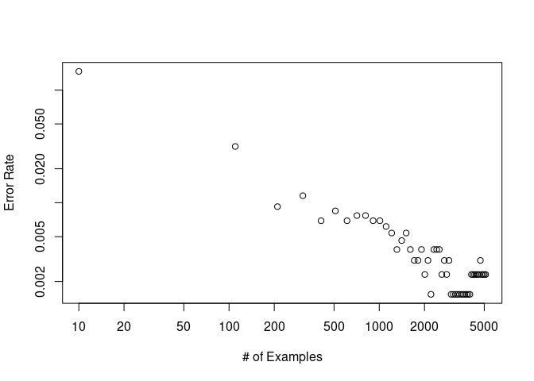

Classification
================
Jake Searcy
2023-09-05

``` r
knitr::opts_chunk$set(echo = TRUE)
library('randomForest')
```

    ## randomForest 4.6-14

    ## Type rfNews() to see new features/changes/bug fixes.

``` r
download.file("https://archive.ics.uci.edu/static/public/186/wine+quality.zip",'wine_data.zip')
unzip('wine_data.zip')
```

# Classification Algorithms

All machine learning is trying to approximate a function that maps some
inputs to outputs.

Classification is a type of Machine Learning algorithm that aims to
predict the class something belongs to from a set of features. Inputs
vary, but the output is the probability that an example belongs to a
class.

Examples \* From pixels in an image, predict whether it’s a dog or a cat
\* From social media text, determine if a statement is positive or
negative. \* From measurements of an animal, determine its species

Two main categories \* Binary classification - You have only two classes
Positive/Negative, True/False, Cat/Dog \* Target values are a 0 or a 1
\* Target values can be string label Dog/Cat

- Multiclass Classification - You have several classes Cat/Dog/Bird,
  0/1/2/3/4/5/6…
  - Target values can be expressed in several ways
    - A string with a class’s label
    - A number labeling the class
    - A one-hot encoded vector which is a vector with length equal to
      the number of classes with precisely one entry labeled as a one
      and the rest zero.
      - i.e., For three classes
      - The first class is represented as \[1,0,0\]
      - The first class is represented as \[0,1,0\]
      - The first class is represented as \[0,0,1\]

# Create a Wine-dataset

read in data from two csvs, and combine them in R (we could do the same
in bash). \* Generally for ML Datasets we want \* Clear data splits -
(at a minnium a training datset and a testing dataset) \* No missing
values \* At least one clear target

``` r
red<-read.csv('winequality-red.csv',header=TRUE,sep=';')
white<-read.csv('winequality-white.csv',header=TRUE,sep=';')
#Let's combine both datasets and add a column to distingush red vs white
red$isred <-1
white$isred <-0

head(red)
```

    ##   fixed.acidity volatile.acidity citric.acid residual.sugar chlorides
    ## 1           7.4             0.70        0.00            1.9     0.076
    ## 2           7.8             0.88        0.00            2.6     0.098
    ## 3           7.8             0.76        0.04            2.3     0.092
    ## 4          11.2             0.28        0.56            1.9     0.075
    ## 5           7.4             0.70        0.00            1.9     0.076
    ## 6           7.4             0.66        0.00            1.8     0.075
    ##   free.sulfur.dioxide total.sulfur.dioxide density   pH sulphates alcohol
    ## 1                  11                   34  0.9978 3.51      0.56     9.4
    ## 2                  25                   67  0.9968 3.20      0.68     9.8
    ## 3                  15                   54  0.9970 3.26      0.65     9.8
    ## 4                  17                   60  0.9980 3.16      0.58     9.8
    ## 5                  11                   34  0.9978 3.51      0.56     9.4
    ## 6                  13                   40  0.9978 3.51      0.56     9.4
    ##   quality isred
    ## 1       5     1
    ## 2       5     1
    ## 3       5     1
    ## 4       6     1
    ## 5       5     1
    ## 6       5     1

``` r
all=merge(red,white,all=TRUE)
#Check for missing values
is.null(all)
```

    ## [1] FALSE

## Split the data into 80% train and 20% test

use the sample command to randomly select indices

``` r
# Randomly Select training indices
train_index <- sample(seq_len(nrow(all)),size= nrow(all)*.8, replace=FALSE )


#Split the data
wine_train <- all[train_index,]
wine_test <- all[-train_index,]
```

# Classification Algorithms

There are several kinds of classification algorithms \* Logistic
Regression \* Support Vector Machine \* Random Forest \* Deep Neural
Networks \* Lots more

It’s common to try several to see which one works best; however, a few
things to think about \* Not all algorithms do multi-class
classification \* Some algorithms are computationally expensive \* Some
work better on bigger datasets \* We are working with structured data,
but generally, different kinds of data will need different kinds of
algorithms You’ll have to try and balance the tradeoffs for your
problem.

Today we will start with Random Forests which can be used with both
binary and multi-class classification. **For now, just think of it as a
kind of program that learns from examples**

## There are some differences in how algorithms work in the two classification cases

- Outputs for binary classification is just a single number between 0-1
  that it belongs to the first class (or which every class is labeled by
  a 1/True). The probability it belongs to a second class is just one
  minus the probability of the first class.

- Outputs for multi-class classification is one number **per** class
  with the probability that the example belongs to that class **the sum
  of all these numbers must equal one**

- It’s true that binary classification is a subset of multi-class
  classification (with just two classes), but it is common you’ll see
  the distinction

## Probability to Predictions

Classification models often output probability, but if you want to
calculate things like accuracy, you need to guess the true class: \*
Binary classification if probability \> 0.5 True otherwise False \*
Multi-class classification prediction has the greatest probability **You
don’t have to follow these rules** - you can use your own thresholds if
you want to be more confident in your predictions

# Random Forests

``` r
?randomForest
```

Lots of options, but the simplest usage is just giving this function an
x and a y.

``` r
# Let's get our x's and y's 
# In this case lets try to predict if a wine is red or white


x<-subset(wine_train, select=-isred)
y<-as.factor(wine_train$isred)

xtest<-subset(wine_test, select=-isred)
ytest<-as.factor(wine_test$isred)
```

Now you can fit your data in one line.

``` r
rf=randomForest(x,y,xtest,ytest,ntree=100,importance=TRUE,keep.forest=TRUE)
rf
```

    ## 
    ## Call:
    ##  randomForest(x = x, y = y, xtest = xtest, ytest = ytest, ntree = 100,      importance = TRUE, keep.forest = TRUE) 
    ##                Type of random forest: classification
    ##                      Number of trees: 100
    ## No. of variables tried at each split: 3
    ## 
    ##         OOB estimate of  error rate: 0.6%
    ## Confusion matrix:
    ##      0    1 class.error
    ## 0 3910    8 0.002041858
    ## 1   23 1256 0.017982799
    ##                 Test set error rate: 0.38%
    ## Confusion matrix:
    ##     0   1 class.error
    ## 0 980   0    0.000000
    ## 1   5 315    0.015625

# Predictions

``` r
#Predict Classes Red or White
outputs=predict(rf,xtest,type='response')
head(outputs)
```

    ##  4  5  6  8 16 23 
    ##  0  0  0  0  0  0 
    ## Levels: 0 1

``` r
#Predict Probabilities Red or White
cont_outputs=predict(rf,xtest,type='prob')
head(cont_outputs)
```

    ##       0    1
    ## 4  0.96 0.04
    ## 5  0.98 0.02
    ## 6  0.94 0.06
    ## 8  0.90 0.10
    ## 16 0.63 0.37
    ## 23 0.99 0.01

Check the quality of predictions with a histogram

If everything worked well, the red wines should have probabilities near
one and whites near zero

``` r
options(repr.plot.width=20,repr.plot.height=10)
ax<-pretty(0:1,n=50)
hRed<-hist(cont_outputs[ytest==1,2],plot=FALSE,breaks=ax)
hWhite<-hist(cont_outputs[ytest==0,2],plot=FALSE,breaks=ax)

c1=rgb(1,.1,.2,alpha=.80)
c2=rgb(1,1.,.2,alpha=.80)

plot(hWhite,col=c2,xlab='P(Red|X)')
plot(hRed, col=c1,add=TRUE)
legend(.8,600,legend=c('Whites','Reds'),fill=c(c2,c1))
```

<!-- -->

``` r
#List Red wines with the highest probability of being white wines
index<-sort(cont_outputs[ytest==1,1],decreasing=TRUE)
index[1:10]
```

    ## 1925 3608 2427 2522 5247 4852 4960   63 4585 5958 
    ## 0.92 0.82 0.62 0.50 0.50 0.46 0.38 0.37 0.35 0.34

``` r
# Let's look at the most 'white-like' red
all[583,]
```

    ##     fixed.acidity volatile.acidity citric.acid residual.sugar chlorides
    ## 583           5.9             0.29        0.25           13.4     0.067
    ##     free.sulfur.dioxide total.sulfur.dioxide density   pH sulphates alcohol
    ## 583                  72                  160 0.99721 3.33      0.54    10.3
    ##     quality isred
    ## 583       6     1

# Importance

A good next question is what why there are some outliers and how the
model is deciding between what is a red wine and what is a white wine.

    This is another thing to think about when selecting a model, how easy is it to get out meaningful information about how it's making decisions

    Random forests often use Mean Decrease in Accuracy - which means how much worse in the classifier when a variable is not included. If the classifier is bad after removing a variable, it is considered important.

``` r
importance(rf)
```

    ##                              0         1 MeanDecreaseAccuracy MeanDecreaseGini
    ## fixed.acidity        10.462648 10.331055            15.018679       111.616856
    ## volatile.acidity     14.516181 14.714145            17.531745       253.724011
    ## citric.acid           7.892629  8.055556            10.266292        37.796059
    ## residual.sugar        6.202881 10.922946             9.751422        75.937207
    ## chlorides            20.455477 23.975465            29.581968       424.397750
    ## free.sulfur.dioxide   8.806534  4.913043             9.431943        83.863102
    ## total.sulfur.dioxide 26.929704 30.859118            41.100544       678.283095
    ## density               7.433642 16.494323            14.309272        87.080245
    ## pH                   10.974772 10.266777            12.772945        41.292459
    ## sulphates            15.242034 14.788397            17.681101       108.941386
    ## alcohol               9.390083  8.139197            12.329167        18.860496
    ## quality               3.168057  2.807988             3.992165         3.959976

# Question

Is a higher total sulfur dioxide more or less likely in red wine?

``` r
ax<-pretty(0:500,n=100)

hRed<-hist(red$'total.sulfur.dioxide',plot=FALSE,breaks=ax)
hWhite<-hist(white$'total.sulfur.dioxide',plot=FALSE,breaks=ax)

c1=rgb(1,.1,.2,alpha=.80)
c2=rgb(1,1.,.2,alpha=.80)

plot(hWhite,col=c2)
plot(hRed, col=c1,add=TRUE)
```

<!-- -->

\#Exercise

We had one red wine classify as exceptionally white-like. From the
importance values and histogram plots you make. Can you find out why one
of the red wines was classified very likely as a white wine?

``` r
"Your Code"
```

    ## [1] "Your Code"

Now Train your own random forest and see if you can determine what the
most important factors influencing wine quality are?

``` r
"Your Code"
```

    ## [1] "Your Code"

# How much data do you need?

This is a trick question - lets see when we train with different dataset
sizes

``` r
nd=500
y_data <- c()
x_axis=seq(from=10,to=nrow(x),by=100)
for (nd in x_axis){
    rf=randomForest(x[1:nd,],y[1:nd],xtest,ytest,ntree=500,importance=TRUE)
    y_data<-append(y_data,rf$test$err.rate[500,1])
}
plot(x_axis,y_data,log='yx',xlab='# of Examples',ylab="Error Rate")
```

<!-- -->
