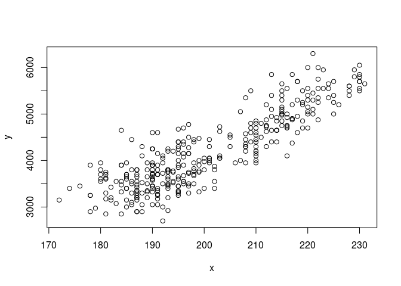
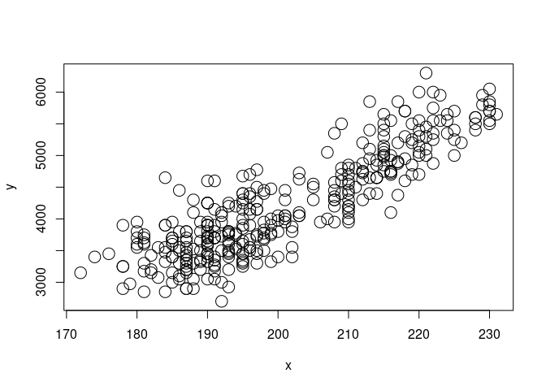
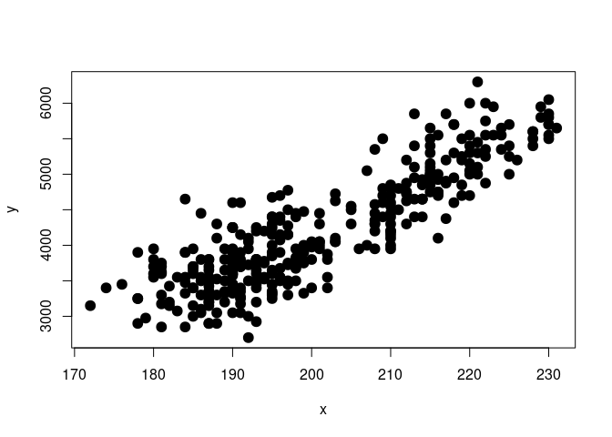
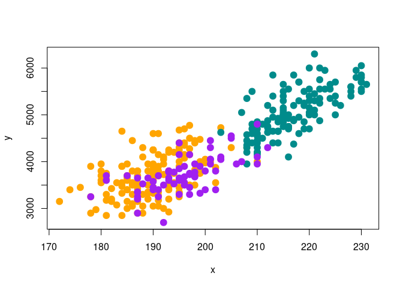

Intro to R
================
Emily Beck for Data4ML - <https://uo-data-science.github.io/Data4ML1/>
Modified by Jake Searcy

# Gateway Week Introduction to R

#### Tomorrow: We will learn about Markdown formats and how to create annotated code like you are using today!

#### Today: Let’s focus on learning the basics of R

## Learning Objectives

#### \* Learn to find HELP!

#### \* Learn to use the hashtag

#### \* Assign varaibales

#### \* Use vectors

#### \* Describe what a function is

#### \* Learn to ingest files

#### \* Learn how to manipulate a dataframe in R like we did in Bash

#### \* Learn to *Install* and *Load* packages

#### \* Learn some basic plotting including histograms, scatter plots, and box plots

## **Part One: Getting Help**

#### The question mark ‘?’ is your best friend in R

#### Want to learn more about a function or package or anything just type ? and your query.

#### Help! I want to know more about how to make a boxplot!

``` r
?boxplot
```

#### Go ahead and play around with the ? and look up something you are interested in

## **Part Two: Basic coding mechanics**

### **(1) Using the hashtag**

``` r
# Use the hashtag to "comment out" anything you don't want to run.
# Useful for making notes about what each line of code is doing!

#I am adding 3 and 5
3+5
```

    ## [1] 8

``` r
#Comment often!
#### your future self will be so happy to be able to look back and know exactly what you did!
# Use comments like a lab notebook ####

######### The number of hashtags don't matter ########

## New project genetic mapping neutrophil variation
## Load Packages
## Ingest raw csv file
## Attempt one mapping as a single population
## plot raw outputs 
## plot cleaned data using filter of 50
```

#### We obviously want to learn to do more complicated things than add 3 and 5. The fist step is to learn to assign variables.

### **(2) Assigning Variables**

#### To assign a value to a variable we need:

#### - to name our variable

#### - use the *assignment operator* \<-

#### - give the value of our variable

``` r
#assign a variable called "variable" a value of 3
variable <- 3

#add variable and 5
variable + 5
```

    ## [1] 8

#### Why is this useful? Why not just add 3 + 5?

#### This is a super simple case.

### Tips for assigning and naming variables:

##### - You will thank your past-self if you pick variable names that are descriptive.

##### - Remember if you are typing you are doing it wrong!

##### - If you have assigned a variable previously you can recall it using tab complete.

##### - Avoid special characters. NO SPACES. The underscore is your best friend for readable names. Penguin_height for example.

##### - Variable names are case sensitive. Penguin_height and Penguin_Height are different variables.

##### - You cannot begin a variable name with a number, but you can use numbers in the name. 2X is not ok but X2 is.

#### Assigning variables is necessary in R. We often don’t assign a single value to a variable but maybe assign a list of values to be used to run a program. These can be stored using a vector.

### **(3) Vectors**

#### A vector is the most common and basic data structure in R, and is pretty much the workhorse of R. It’s basically just a list of values, mainly either numbers or characters.

#### You can assign this list of values to a variable, just like you would for one item. For example we can create a vector of genome lengths:

``` r
### Create a vector of heights for male penguins

male_height_meters <- c(1.1, 1,2, 1.6, 1.3)

#View my male height vector by running the variable name
male_height_meters
```

    ## [1] 1.1 1.0 2.0 1.6 1.3

``` r
#Did you use tab complete?

#Create another vector for heights of female penguins
female_height_meters <- c(0.8, 0.75, 1, 0.9)

#View my female height vector
female_height_meters
```

    ## [1] 0.80 0.75 1.00 0.90

#### Now that I have my vectors the world is my oyster!

#### I can use the power of R to compare these vectors statistically or plot them is cool ways using R packages and R functions!

### **(4) Functions**

#### Another key feature of R are functions: R’s built in capabilities.

##### - Some are mathematical functions, like *sqrt* and *round*.

##### - some are great for plotting like *plot*.

##### - Some are from libraries/packages (which we’ll talk about in a bit)

##### - or you can even write your own (which you will learn to do later today!)

#### Functions are “canned scripts” that automate something complicated or convenient or both.

``` r
## Functions work following a standard format function(argument)
## Let's try a simple example by calling the function round

#round(3.14159265)

## We can also use a variable or vector as an argument
## Is average height significantly different between male and female penguins?
## Let's do a t test to see

sex_height_compare <-t.test(male_height_meters,female_height_meters)
sex_height_compare
```

    ## 
    ##  Welch Two Sample t-test
    ## 
    ## data:  male_height_meters and female_height_meters
    ## t = 2.83, df = 4.725, p-value = 0.0391
    ## alternative hypothesis: true difference in means is not equal to 0
    ## 95 percent confidence interval:
    ##  0.04060114 1.03439886
    ## sample estimates:
    ## mean of x mean of y 
    ##    1.4000    0.8625

``` r
##If your question mark search fails you can use google to find the right search term
## Example ?ttest fails but ?t.test works. I had to google that one!
```

#### Functions can get more complicated and have lots of flags as options. The question mark can help you navigate new functions to find out what you need and what your options are.

#### Working with vectors is great but sometimes we have outside data files we want to work with.

#### For example, we may have a csv file or large data frame we want to use.

### **(5) Ingesting Files**

``` r
## There are small differences between loading different file types 

#You can read in many types of files using these common components:
#file: the path to the file containing the data to be imported into R.
#sep: the field separator character. “\t” is used for tab-delimited file.
#header: logical value. If TRUE, read.table() assumes that your file has a header row, so row 1 is the name of each column. If that’s not the case, you can add the argument header = FALSE.
#dec: the character used in the file for decimal points.

### Read tabular data into R
#read.table(file, header = FALSE, sep = "", dec = ".")

###
# Read "comma separated value" files (".csv")
###read.csv(file, header = TRUE, sep = ",", dec = ".")

## We can assign a variable to our outside file to be used in the R environment
penguins <- read.csv("data/penguins.csv", header = TRUE, sep = ",", dec = ".")
```

#### Now that we have ingested out file we can manipulate it like we did using bash

### **(6) Dataframe manipulations**

#### Once ingested dataframes can be manipulated using a simple common convention \[rows,columns\]

``` r
#### Let's play around with our penguin file

#make a new file of just columns 1, 6, 7
penguins_cut <- penguins[,-c(2:5,8)]

#Try playing around with cutting different rows and column and check what your files look like

#If we want to assign variable to individual columns we can do that as well using the header labels
flipper_length <- penguins$flipper_length_mm
body_mass <- penguins$body_mass_g

#Once we have our files prepared how we want them we are ready to use any functions we choose.
```

### **(7) Installing and Loading Packages**

#### We talked before about the wide range of R packages available from a series of open source repositories

#### Once I have identified a package I want to use how do I install it? How do I use it?

``` r
#Install a package
#install.packages("a package name")
#The exact package name goes inside the quotes. R Studio or Open  OnDemand can then install your desired package.

install.packages("palmerpenguins")
```

    ## Installing package into '/usr/local/lib/R/site-library'
    ## (as 'lib' is unspecified)

``` r
#Loading an installed package from your library
#library('a package')
library("palmerpenguins")
```

    ## 
    ## Attaching package: 'palmerpenguins'

    ## The following object is masked _by_ '.GlobalEnv':
    ## 
    ##     penguins

#### We are going to work with more R packages later in some hands on ML exercises but for now let’s pivot to another useful feature of R…

## **Part Three: Plotting!**

#### Remember the Question Mark. We will talk through some basic plotting here, but you can use the question mark function to learn about other data visualization options.

``` r
#Uncomment the one you want info on!

## Get info on scatterplots
#?plot

##Get info on histograms
?hist

## Get info on boxplots
#?boxplot
```

#### We won’t have time to go through all of these but there is a ton of online resources for making pretty plots in R.

#### For now let’s go throuh an example using scatterplots

``` r
#Plotting a scatter plot of flipper length to body mass using penguins.csv

#Step 1: Read in my csv file
#penguins <- read.csv("penguins.csv", header = TRUE, sep = ",", dec = ".")

#Define my x and y axes
x = penguins$flipper_length_mm
y = penguins$body_mass_g

#Make a basic scatterplot
plot(x,y)
```

<!-- -->

``` r
#This isn't a very useful plot! Let's play around with color and shape options to make outr plot more informative.

#Common useful flags when plotting
#cex- point size, play around with various values to select a plot size that works for you
plot(x,y, cex = 2)
```

<!-- -->

``` r
#pch- point shape google pch in R to get a list of options
plot(x,y, cex = 1.5, pch = 19)
```

<!-- -->

``` r
#col- used to set a color, there are TONS of otions in R google R color codes to get a list
plot(x,y,cex = 1.5, pch = 19, col ="blue")
```

<!-- -->

``` r
#Prettier, but still not useful

#Let's make a plot with points of different colors based on species of penguin
#There are several ways to do this

#option 1 if else statements

plot(x,y, cex = 1.5, pch = 19, col = ifelse(penguins$species == "Adelie", "orange", ifelse(penguins$species == "Chinstrap", "purple","darkcyan")))
```

<!-- -->

``` r
#A few notes on ifelse statements
# you have to use two equal signs to indicate you need an exact match
# you can also use < > <= >= if you want to color by a numerical value for example color all point less than 200 blue
#Ifelse statements are ok when working with small numbers of groups but can get annoying if you are plotting a lot

#Another option is using a vector

colors <- c("orange", "purple", "darkcyan")
plot(x,y,cex = 1.5, pch = 19, col = colors[factor(penguins$species)])

#Go ahead and change the shapes of the points based on sex!
#follow the same logic as we did with color but using pch
```

#### Histograms are similar in coding structure to scatterplots with slightly differnt options for making pretty plots

``` r
# Make a histogram
hist(penguins$flipper_length_mm)
```

<!-- -->

``` r
#Other useful tips
#use add =TRUE to pile plot on top of one another
#use xlim and ylim to manually set axes
#use abline h = 3 to add a horizontal line at the value of 3 (or whatever value you want)

#The limits are endless in R
```

### **Excersice : try to make a histogram by species of flipper length!**
