An R Markdown document converted from
“/home/jsearcy/Data4ML1/notebooks/Unsupervised.ipynb”
================

# Unsupervised ML

There are two broad categories of unsupervised machine learning,
dimensionality reduction, and clustering. We will explore some of these
concepts with our normal penguins dataset.

``` r
library('Rtsne')
library('umap')
library(palmerpenguins)
knitr::opts_chunk$set(echo = TRUE, fig.width = 7, fig.height = 5)
```

# Dimensionality reduction

**Why do you want to do it?** \* Too many variables to easily analyze \*
Too many variables to easily plot

**What are we doing** We want to take our data set with too many
variables and create a new representation of that data that only uses a
few variables. Unlike supervised learning there is no **true** answer
for what counts as a good representation of our data. What are some of
the things we might want to capture \* Keep information that is
**important** \* Maintain distances between data points, so points that
are close together in high dimensions are also close together in low
dimensions \* It’s useful if the representations have variables tare
independent of each other

There are a few common ways to do this:

1.  PCA - Creates well defined linear representations ordered by
    importance, where importance is defined as how much of the dataset’s
    variance can be explained.
    - This method gives you vectors in order of importance, so if you
      want to reduce dimensions you can pick the top 2 or 3
2.  TSNE - non-linear method that is very common
3.  UMAP - non-linear method that is a bit faster than TSNE

# Writing a Plot Function

**Suggestion** If you have to do it more than twice automate it!

We use functions all the time. You can save yourself a lot of time by
writing your own.

Syntax:

``` r
my_function<-function(argument1,argument2){ # open bracket starts the function
# Your code to do something
print(argument1) 
print(argument2)

} #Close bracket finishes the function
```

``` r
#This code creates your function
my_function<-function(argument1,argument2){ # open bracket starts the function
print(argument1) 
print(argument2)
} 
```

``` r
#This code runs your function

my_function('Hello','World')
```

    ## [1] "Hello"
    ## [1] "World"

``` r
my_function('hello','world')
```

    ## [1] "hello"
    ## [1] "world"

# Exercise write a function to print the sum of two numbers

``` r
"Your Code"
```

    ## [1] "Your Code"

``` r
# Make our plots fit better in Jupyter
options(repr.plot.width=20,repr.plot.height=10)

#Get Clean data
penguins_clean<-na.omit(penguins)

#Use only numeric features for tests
train_data<-penguins_clean[,c('bill_length_mm','bill_depth_mm','flipper_length_mm','body_mass_g')]
```

``` r
plot_penguins <- function(x,y,z=NULL) {
print(substitute(x))
#Color points by species
if(is.null(z)){
    z= penguins_clean$species
    legend= c("Adelie", "Chinstrap", "Gentoo","M","F")
    }
else{
    legend=c(1:max(as.numeric(z)),"M","F")
    print(legend)
    }
#Select shape by sex
sh_label=penguins_clean$sex
#Set color choices
colors<-c(c("orange", "purple", "darkcyan"),sample(colors()))
shapes<-c(19,2)
#Plot
par(mar=c(5.1,4.1,4.1,10.1),xpd=TRUE)
#par(xpd=TRUE)

plot(x,y,col=colors[factor(z)],
        xlab=deparse(substitute(x)),
       ylab=deparse(substitute(y)), 
     pch=shapes[factor(sh_label)],cex=1,cex.axis=1,cex.lab=1)

#add legend
legend("topright",inset=c(-0.2,0.0), legend = legend, bty = "n",      
       pch = c(rep(shapes[2],length(legend)-2),shapes),
               col = c(colors[1:(length(legend)-2)],c('black','black')),cex=1,text.width=1.5)
    
#p<-ggplot(data = penguins_clean,aes(x = x,y = y, color=species,shape=sex)) +
#                      geom_point(aes(color=bill_depth_mm))    
#print(p)   
}


#plot_penguins(penguins_clean$flipper_length_mm,penguins_clean$body_mass_g)
plot_penguins(penguins_clean$flipper_length_mm,penguins_clean$body_mass_g)
```

    ## penguins_clean$flipper_length_mm

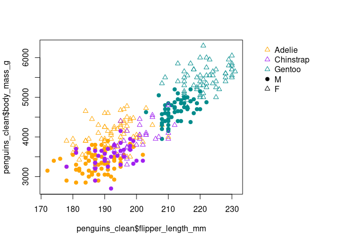<!-- -->

# Principal Component Analysis

Run PCA and make a Scree Plot. A scree plot is just the amount of
variance explained by each PC. Your looking for a Knee to decided how
many vectors to keep.


``` r
pca_out=prcomp(train_data)

penguins_clean$pca_1<-pca_out$x[,1]
penguins_clean$pca_2<-pca_out$x[,2]

#calculate total variance explained by each principal component
var_explained = pca_out$sdev^2 / sum(pca_out$sdev^2)

#create scree plot
plot(var_explained,type='l')
```

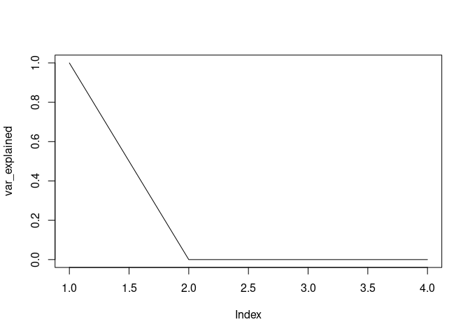<!-- -->

# Question does this make sense?

``` r
#This Calculates the Standard Deviation of each column
apply(train_data,2,sd)
```

    ##    bill_length_mm     bill_depth_mm flipper_length_mm       body_mass_g 
    ##          5.468668          1.969235         14.015765        805.215802

``` r
?scale
```

``` r
apply(scale(train_data),2,sd)
```

    ##    bill_length_mm     bill_depth_mm flipper_length_mm       body_mass_g 
    ##                 1                 1                 1                 1

``` r
#This way 
#pca_out=prcomp(scale(train_data))
#OR This way
pca_out=prcomp(train_data,scale=TRUE)

pca_out
```

    ## Standard deviations (1, .., p=4):
    ## [1] 1.6569115 0.8821095 0.6071594 0.3284579
    ## 
    ## Rotation (n x k) = (4 x 4):
    ##                          PC1         PC2        PC3        PC4
    ## bill_length_mm     0.4537532 -0.60019490 -0.6424951  0.1451695
    ## bill_depth_mm     -0.3990472 -0.79616951  0.4258004 -0.1599044
    ## flipper_length_mm  0.5768250 -0.00578817  0.2360952 -0.7819837
    ## body_mass_g        0.5496747 -0.07646366  0.5917374  0.5846861

``` r
penguins_clean$pca_1<-pca_out$x[,1]
penguins_clean$pca_2<-pca_out$x[,2]

#calculate total variance explained by each principal component
var_explained = pca_out$sdev^2 / sum(pca_out$sdev^2)


#create scree plot
library(ggplot2)

qplot(c(1:4), var_explained) + 
  geom_line() + 
  xlab("Principal Component") + 
  ylab("Variance Explained") +
  ggtitle("Scree Plot") +
  ylim(0, 1)
```

    ## Warning: `qplot()` was deprecated in ggplot2 3.4.0.
    ## This warning is displayed once every 8 hours.
    ## Call `lifecycle::last_lifecycle_warnings()` to see where this warning was
    ## generated.

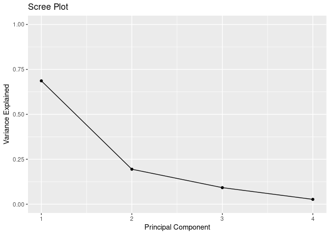<!-- -->

``` r
plot_penguins(penguins_clean$pca_1,penguins_clean$pca_2)
```

    ## penguins_clean$pca_1

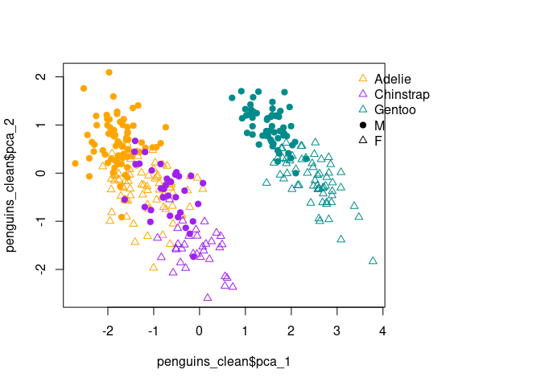<!-- -->

# TSNE

``` r
library('Rtsne')
```

``` r
#tsne_out<-Rtsne(train_data,perplexity=5,max_iter=500,theta=0,normalize=TRUE)
tsne_out<-Rtsne(scale(train_data),perplexity=15,normalize=TRUE)

penguins_clean$tsne_1<-tsne_out$Y[,1]
penguins_clean$tsne_2<-tsne_out$Y[,2]


#colnames(penguins)
plot_penguins(penguins_clean$tsne_1,penguins_clean$tsne_2)
```

    ## penguins_clean$tsne_1

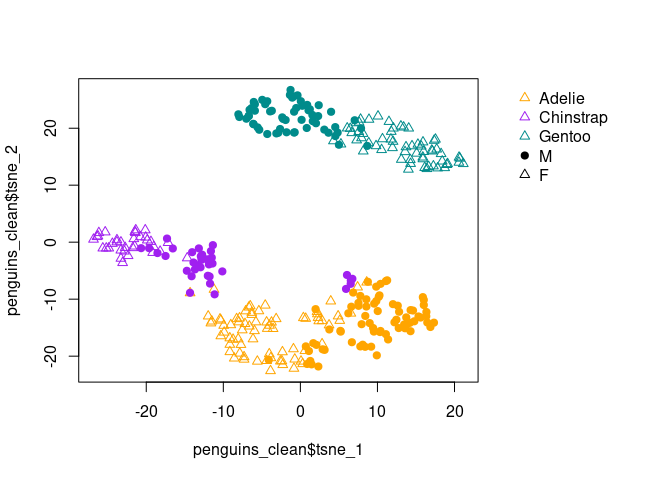<!-- -->

# Try a few different values of perplexity and try un-scaled

# UMAP

``` r
umap_model=umap(scale(train_data),n_neighbors=15)
umap_out=predict(umap_model,scale(train_data))
penguins_clean$umap_1<-umap_out[,1]
penguins_clean$umap_2<-umap_out[,2]
```

``` r
plot_penguins(penguins_clean$umap_1,penguins_clean$umap_2)
```

    ## penguins_clean$umap_1

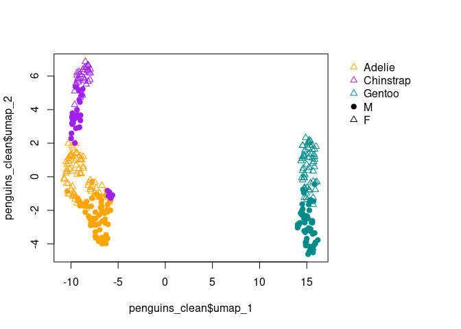<!-- -->

# Question kinds of question would this data be useful in answering?

# Clustering

Kmeans clustering!

``` r
k_means_out=kmeans(train_data,3)
penguins_clean$km3=k_means_out$cluster
```

``` r
plot_penguins(penguins_clean$body_mass_g,penguins_clean$flipper_length_mm,z=penguins_clean$km3)
```

    ## penguins_clean$body_mass_g
    ## [1] "1" "2" "3" "M" "F"

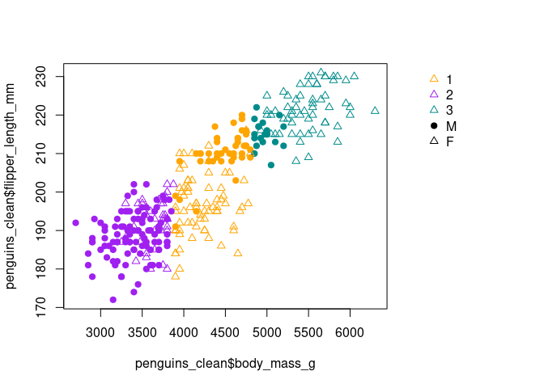<!-- -->

``` r
plot_penguins(penguins_clean$body_mass_g,penguins_clean$flipper_length_mm)
```

    ## penguins_clean$body_mass_g

<!-- -->

# We have the same problems with scale clustering is dominated by body mass

``` r
k_means_out=kmeans(scale(train_data),3)
penguins_clean$km3_scale=k_means_out$cluster
plot_penguins(penguins_clean$body_mass_g,penguins_clean$flipper_length_mm,z=penguins_clean$km3_scale)
```

    ## penguins_clean$body_mass_g
    ## [1] "1" "2" "3" "M" "F"

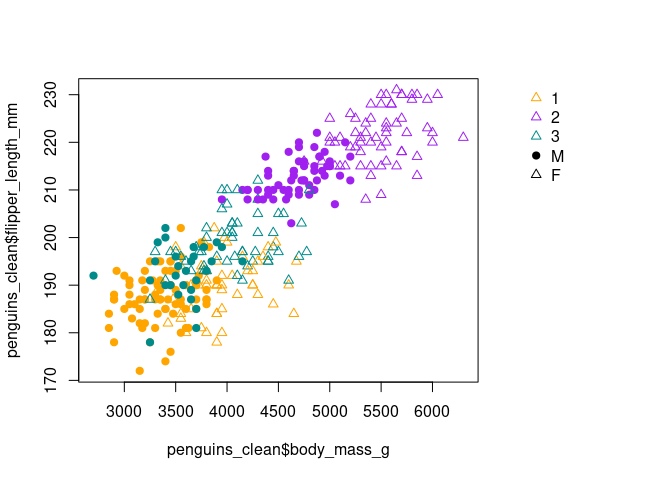<!-- -->

``` r
plot_penguins(penguins_clean$body_mass_g,penguins_clean$flipper_length_mm,z=penguins_clean$species)
```

    ## penguins_clean$body_mass_g
    ## [1] "1" "2" "3" "M" "F"

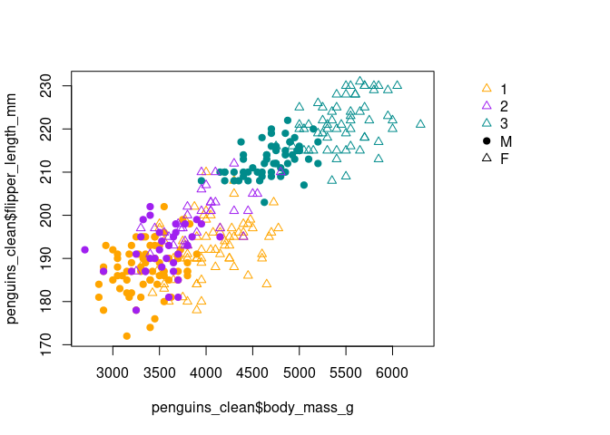<!-- -->

``` r
# How many clusters
k_means_1=kmeans(scale(train_data),1)
k_means_2=kmeans(scale(train_data),2)
k_means_3=kmeans(scale(train_data),3)
k_means_4=kmeans(scale(train_data),4)
k_means_5=kmeans(scale(train_data),5)
k_means_6=kmeans(scale(train_data),6)
k_means_7=kmeans(scale(train_data),7)
k_means_8=kmeans(scale(train_data),8)
k_means_9=kmeans(scale(train_data),9)
k_means_10=kmeans(scale(train_data),10)
```

``` r
data=c(k_means_1$tot.withinss,
k_means_2$tot.withinss,
k_means_3$tot.withinss,
k_means_4$tot.withinss,
k_means_5$tot.withinss,
k_means_6$tot.withinss,
k_means_7$tot.withinss,
k_means_8$tot.withinss,
k_means_9$tot.withinss,
k_means_10$tot.withinss       
      )
```

# We can look at a similar ‘scree’ plot for Kmeans

``` r
plot(data)
```

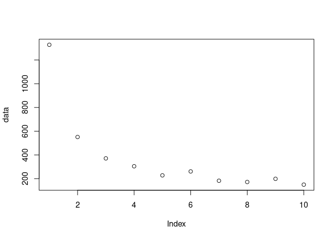<!-- -->

# Writing a for loop to save time

What if we wanted to do this 100 times or 1000 times. If you have to do
it more than twice automate it!

``` r
for (i in 1:50)
{
print(i) # Anything you want here
}
```

The above **for loop** is short hand for

    i=1
    print(i)
    i=2
    print(i)
    ...
    i=50
    print(i)

``` r
for (i in 1:50)
{
print(i) 
}
```

    ## [1] 1
    ## [1] 2
    ## [1] 3
    ## [1] 4
    ## [1] 5
    ## [1] 6
    ## [1] 7
    ## [1] 8
    ## [1] 9
    ## [1] 10
    ## [1] 11
    ## [1] 12
    ## [1] 13
    ## [1] 14
    ## [1] 15
    ## [1] 16
    ## [1] 17
    ## [1] 18
    ## [1] 19
    ## [1] 20
    ## [1] 21
    ## [1] 22
    ## [1] 23
    ## [1] 24
    ## [1] 25
    ## [1] 26
    ## [1] 27
    ## [1] 28
    ## [1] 29
    ## [1] 30
    ## [1] 31
    ## [1] 32
    ## [1] 33
    ## [1] 34
    ## [1] 35
    ## [1] 36
    ## [1] 37
    ## [1] 38
    ## [1] 39
    ## [1] 40
    ## [1] 41
    ## [1] 42
    ## [1] 43
    ## [1] 44
    ## [1] 45
    ## [1] 46
    ## [1] 47
    ## [1] 48
    ## [1] 49
    ## [1] 50

# Exercise Redo the above k-means plot using a for loop

``` r
"Your Code"
```

    ## [1] "Your Code"

# There’s a package for that! A more robust way to pick your cluster number is to look for the maximum gap statistic!

``` r
install.packages('cluster')
```

    ## Installing package into '/usr/local/lib/R/site-library'
    ## (as 'lib' is unspecified)

``` r
library('cluster')

gap_stat <- clusGap(train_data, FUN = kmeans, nstart = 25,
                    K.max = 10, B = 50)

gap_stat_scale <- clusGap(scale(train_data), FUN = kmeans, nstart = 25,
                    K.max = 10, B = 50)
```

``` r
plot(gap_stat)
```

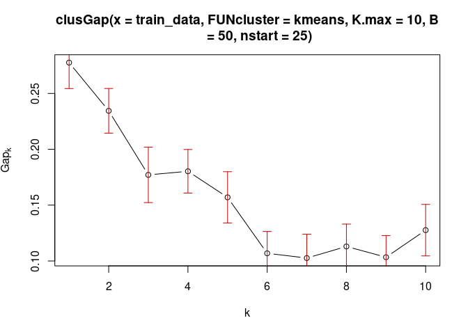<!-- -->

``` r
plot(gap_stat_scale)
```

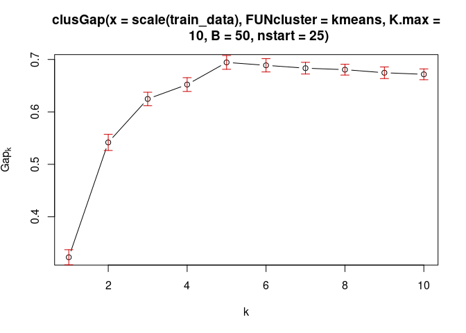<!-- -->

``` r
plot_penguins(penguins_clean$umap_1,penguins_clean$umap_2,z=k_means_5$cluster)
```

    ## penguins_clean$umap_1
    ## [1] "1" "2" "3" "4" "5" "M" "F"

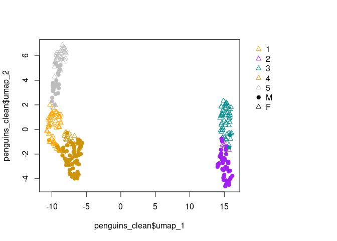<!-- -->

``` r
plot_penguins(penguins_clean$umap_1,penguins_clean$umap_2,z=penguins_clean$species)
```

    ## penguins_clean$umap_1
    ## [1] "1" "2" "3" "M" "F"

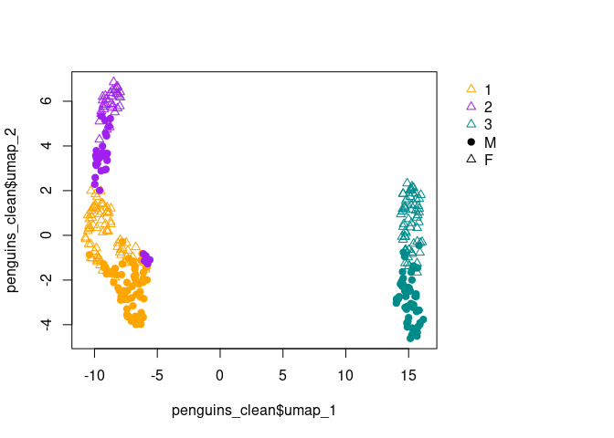<!-- -->

``` r
plot_penguins(penguins_clean$pca_1,penguins_clean$pca_2,z=k_means_5$cluster)
```

    ## penguins_clean$pca_1
    ## [1] "1" "2" "3" "4" "5" "M" "F"

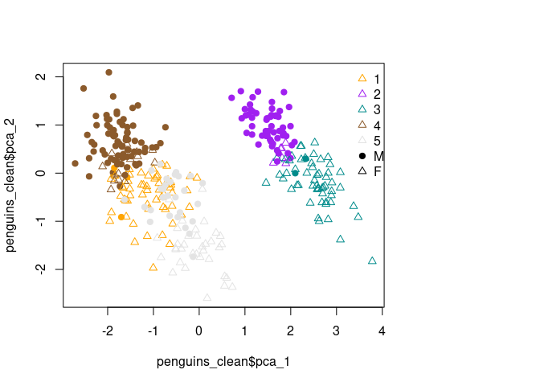<!-- -->

``` r
plot_penguins(penguins_clean$pca_1,penguins_clean$pca_2,z=penguins_clean$species)
```

    ## penguins_clean$pca_1
    ## [1] "1" "2" "3" "M" "F"

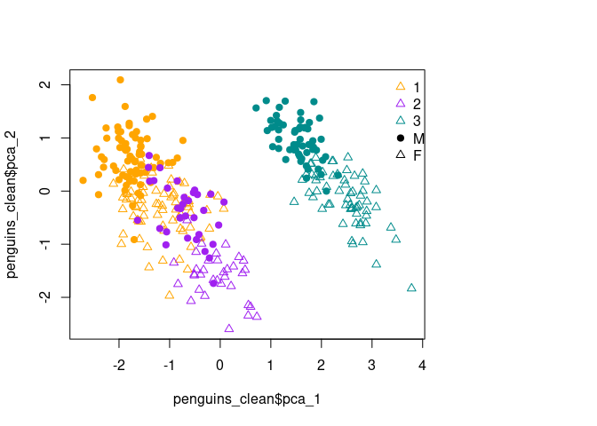<!-- -->

# Dimensionality and clustering

``` r
#Dimensionality

train_data_big<-train_data
train_data_big$r1 <-rnorm(nrow(train_data))
train_data_big$r2 <-rnorm(nrow(train_data))
train_data_big$r3 <-rnorm(nrow(train_data))
train_data_big$r4 <-rnorm(nrow(train_data))
train_data_big$r5 <-rnorm(nrow(train_data))
train_data_big$r6 <-rnorm(nrow(train_data))
train_data_big$r7 <-rnorm(nrow(train_data))
train_data_big$r8 <-rnorm(nrow(train_data))
train_data_big$r9 <-rnorm(nrow(train_data))
train_data_big$r10 <-rnorm(nrow(train_data))


gap_stat_norm <- clusGap(scale(train_data_big), FUN = kmeans, nstart = 25,
                    K.max = 10, B = 50)
```

    ## Warning: did not converge in 10 iterations

``` r
pca_out=prcomp(scale(train_data_big),scale=TRUE)
gap_stat_pca <- clusGap(pca_out$x[,1:2], FUN = kmeans, nstart = 25,
                    K.max = 10, B = 50)

umap_model<-umap(scale(train_data_big),n_components = 2)
umap_out<-predict(umap_model, scale(train_data_big))

gap_stat_umap <- clusGap(umap_out, FUN = kmeans, nstart = 25,
                    K.max = 10, B = 500)
```

``` r
plot(gap_stat_norm)
```

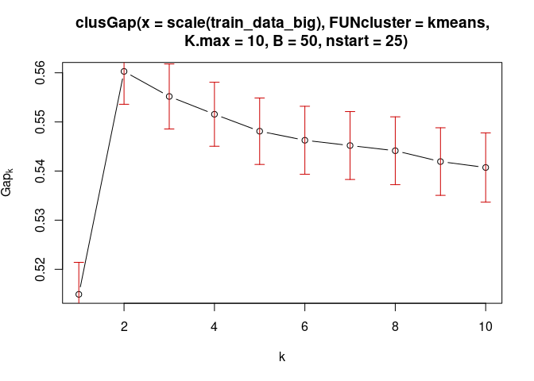<!-- -->

``` r
plot(gap_stat_pca)
```

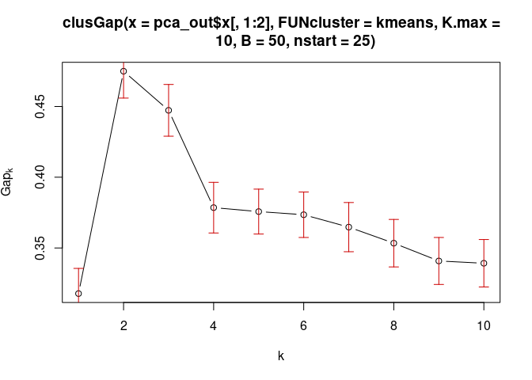<!-- -->

``` r
plot(gap_stat_umap)
```

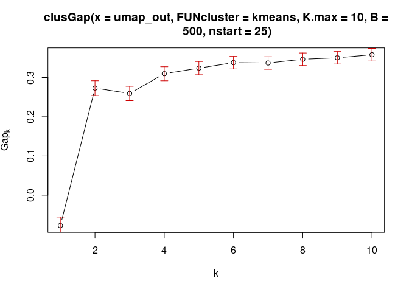<!-- -->

``` r
for( i in 2:ncol(train_data_big)){ 
print(i)
pca_out<-prcomp(train_data_big[,1:i],scale=TRUE)
#calculate total variance explained by each principal component
var_explained = pca_out$sdev^2 / sum(pca_out$sdev^2)
#create scree plot
plot(var_explained,type='l')
    }
```

    ## [1] 2

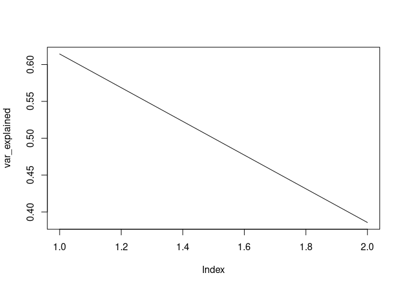<!-- -->

    ## [1] 3

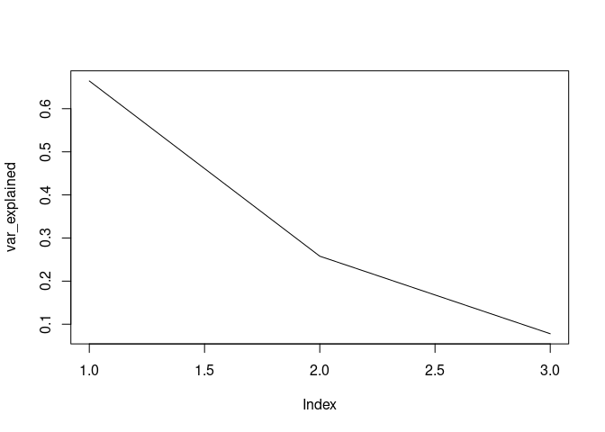<!-- -->

    ## [1] 4

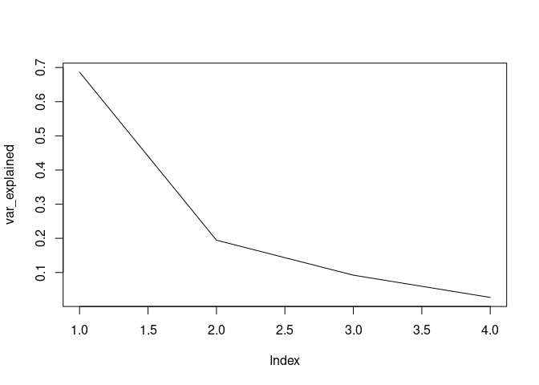<!-- -->

    ## [1] 5

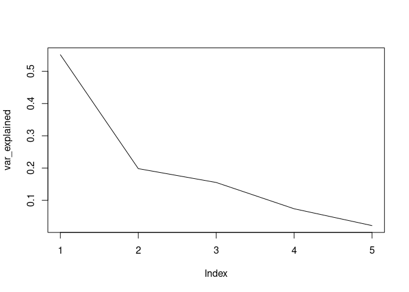<!-- -->

    ## [1] 6

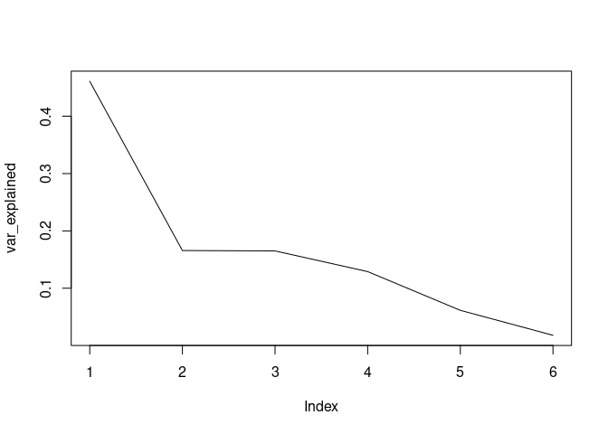<!-- -->

    ## [1] 7

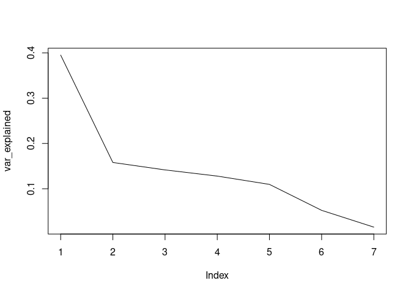<!-- -->

    ## [1] 8

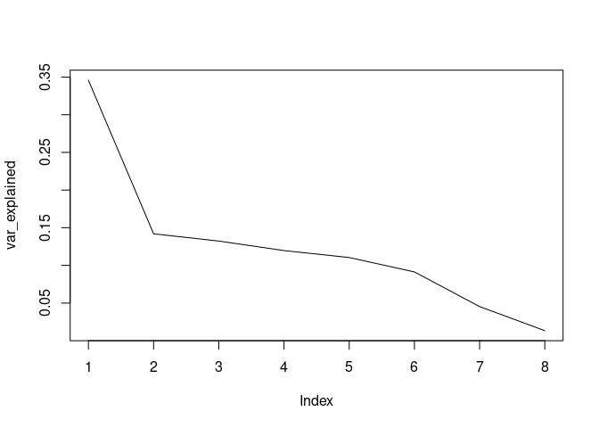<!-- -->

    ## [1] 9

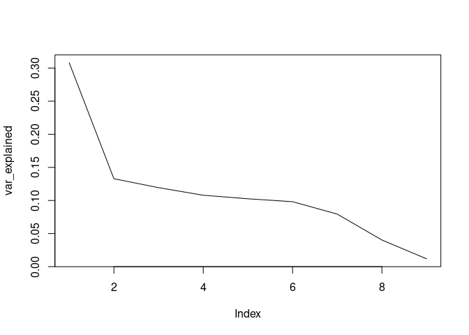<!-- -->

    ## [1] 10

<!-- -->

    ## [1] 11

<!-- -->

    ## [1] 12

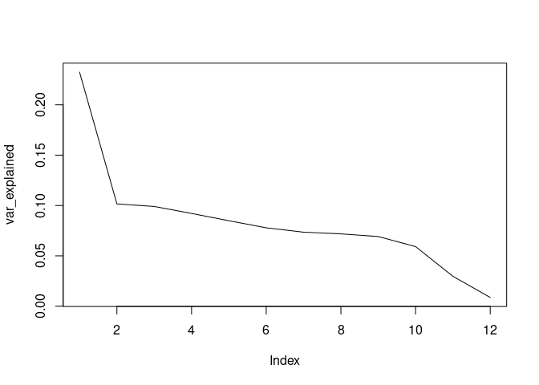<!-- -->

    ## [1] 13

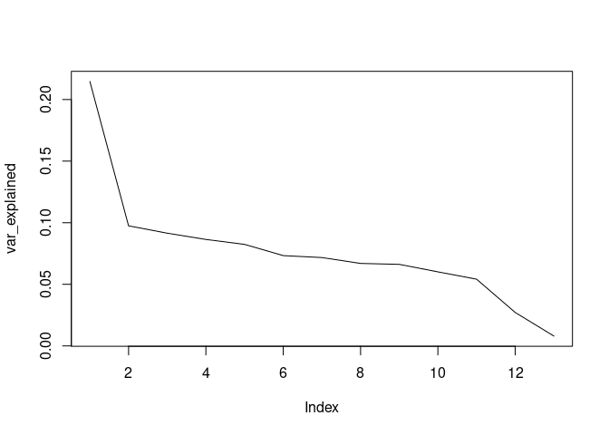<!-- -->

    ## [1] 14

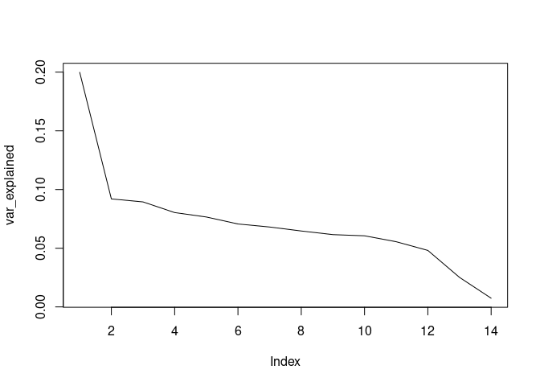<!-- -->

``` r
pca_cl<-kmeans(pca_out$x[,1:2],2)
plot_penguins(pca_out$x[,1],pca_out$x[,2],z=pca_cl$cluster)
```

    ## pca_out$x[, 1]
    ## [1] "1" "2" "M" "F"

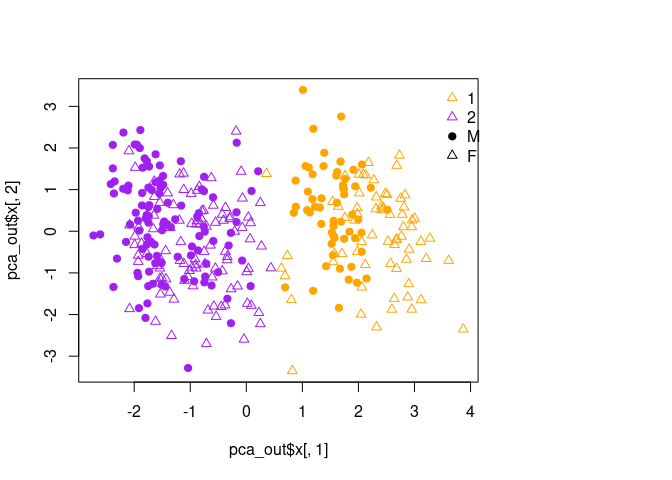<!-- -->

``` r
umap_cl<-kmeans(umap_out,2)
plot_penguins(umap_out[,1],umap_out[,2],z=umap_cl$cluster)
```

    ## umap_out[, 1]
    ## [1] "1" "2" "M" "F"

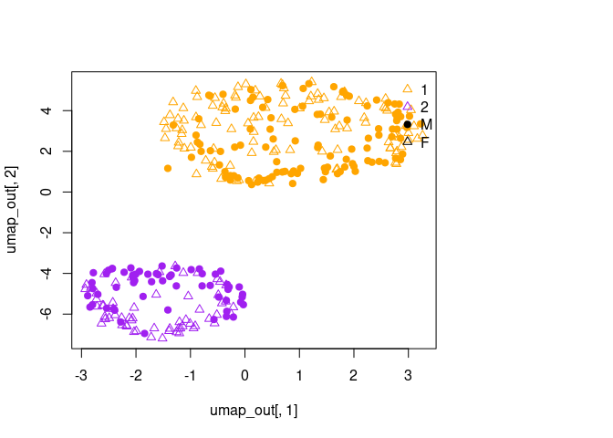<!-- -->

``` r
umap_model<-umap(scale(train_data_big),n_components = 2,n_neighbors = 4)

umap_out<-predict(umap_model,scale(train_data_big),n_components = 2,n_neighbors = 4)

gap_stat_umap <- clusGap(umap_out, FUN = kmeans, nstart = 25,
                    K.max = 10, B = 500)
plot(gap_stat_umap)
```

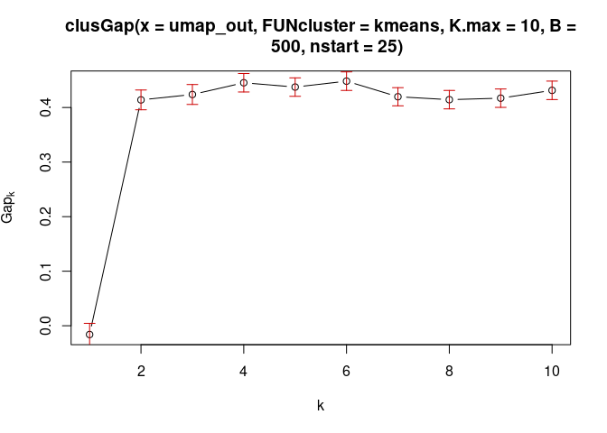<!-- -->

``` r
umap_cl<-kmeans(umap_out,6)
plot_penguins(umap_out[,1],umap_out[,2],z=umap_cl$cluster)
```

    ## umap_out[, 1]
    ## [1] "1" "2" "3" "4" "5" "6" "M" "F"

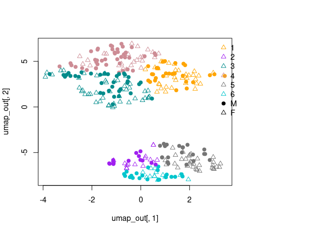<!-- --> \#
Conclusions

- Lots of options when doing unsupervised learning. No **true** answer,
  but some are more useful than others
- **Suggestion** - make sure your conclusions aren’t very sensitive to
  your parameters
- No free lunch lots of irrelevant features makes life more difficult
  and can potentially wash out signal
